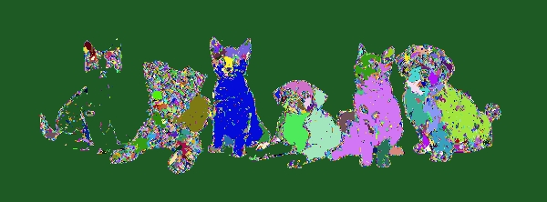

### Region Growing Using Opencv, BFS search and Euclid distance

This repository contains two C++ implementations of a region-growing algorithm using OpenCV. The algorithm segments an image into regions based on the similarity of pixel colors, utilizing Breadth-First Search (BFS) and Euclidean distance for region expansion.

#### Prerequisites

- OpenCV 4.x installed on your system.
- A C++ compiler (e.g., g++).
- CMake (if you prefer building with it instead of the Makefile).

#### Installing Opencv on Ubuntu
`sudo apt update
 sudo apt install libopencv-dev
`

#### Compilation
##### Using make
- Navigate to the src/ directory: `cd src`
- Run the following command to compile both implementations: `make`. This will generate two executables: `reg_grow` and `reg_grow_dir`.
- To clean up the compiled files, use: `make clean`

#### Running the Program
To run the program, use the following command (inside src directory): `./region_grow <image_path> <threshold>` replace the placeholder with the desired value.
Example: `./region_grow ../images/test-image-rg.jpg 12`
This will execute the region-growing algorithm on the sample image with a threshold value of 12.
#### Result
Here is the original image used for segmentation:

Here is the result after applying the region-growing algorithm:

